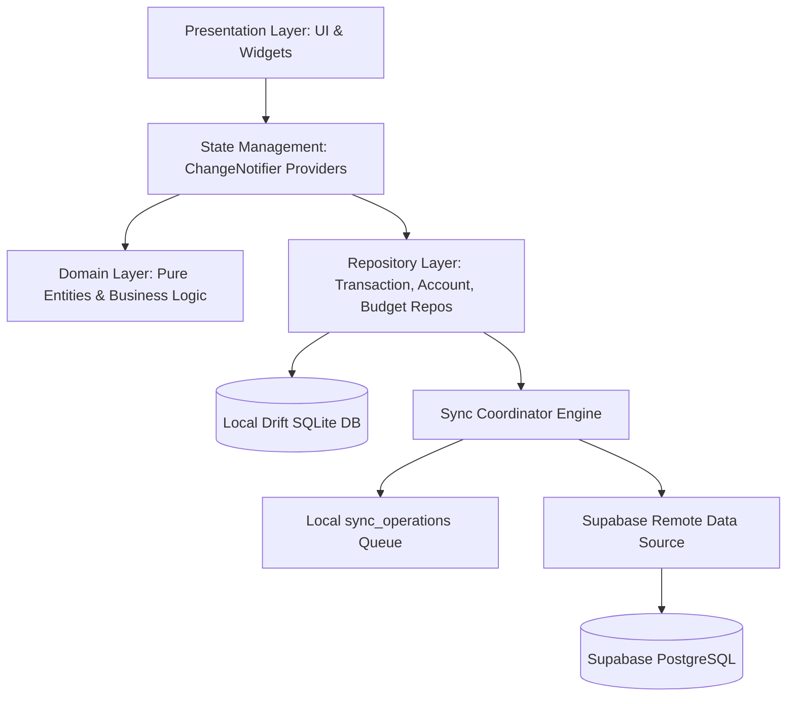
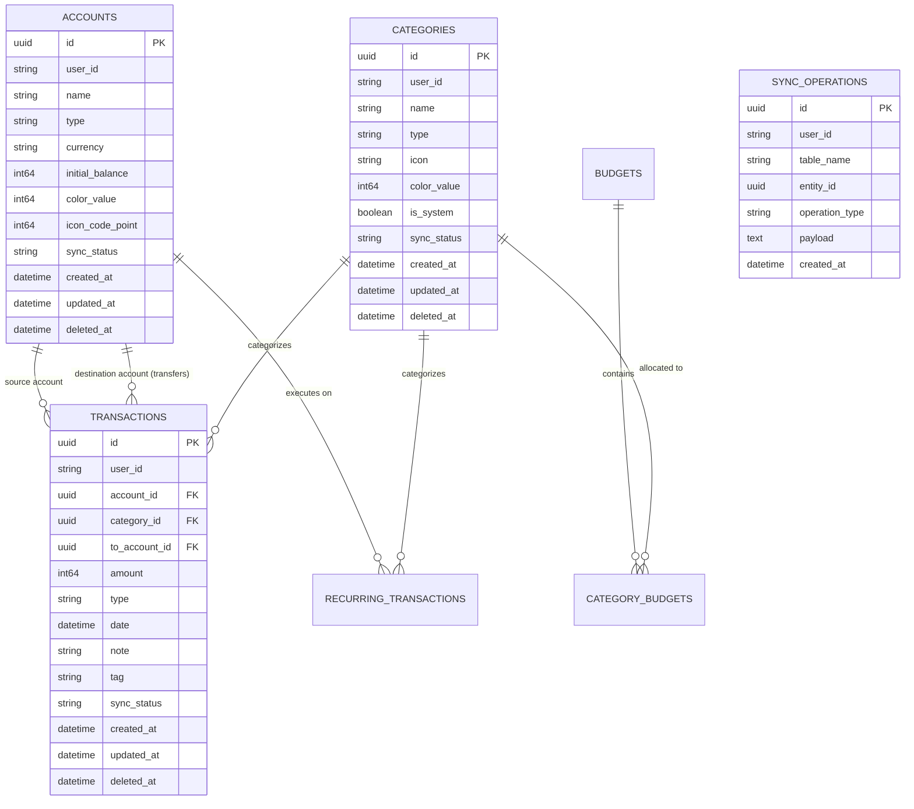

# ExpenseTracker — Production-Grade Offline-First Personal Finance App

[](https://github.com/Extract001/ExpenseTracker/actions/workflows/flutter_ci.yml)
[](https://github.com/Extract001/ExpenseTracker)
[](https://opensource.org/licenses/MIT)
[](https://flutter.dev)
[](https://dart.dev)
[](https://supabase.com)

A robust, enterprise-grade, offline-first personal finance and expense tracking application built with **Flutter**, **Drift (SQLite)**, and **Supabase (PostgreSQL)**. Engineered with zero floating-point financial precision (64-bit integer minor units), end-to-end authenticated encryption for backups (`AES-256-GCM` + `PBKDF2-HMAC-SHA256`), integer micro-unit currency conversions, and automated bidirectional cloud synchronization with Field-Level Last-Write-Wins (LWW) conflict resolution.

---

## 📑 Table of Contents
1. [Project Overview](#1-project-overview)
2. [Features](#2-features)
3. [Screenshots & UI Showcase](#3-screenshots--ui-showcase)
4. [Architecture](#4-architecture)
5. [Database Design](#5-database-design)
6. [Local Database Setup](#6-local-database-setup)
7. [Cloud Setup](#7-cloud-setup)
8. [Sync Strategy](#8-sync-strategy)
9. [Conflict Resolution Strategy](#9-conflict-resolution-strategy)
10. [Installation Instructions](#10-installation-instructions)
11. [Testing Instructions](#11-testing-instructions)
12. [Known Limitations](#12-known-limitations)
13. [License](#13-license)

---

## 1. Project Overview
Managing personal finances demands uninterrupted reliability, strict data privacy, and mathematical precision. **ExpenseTracker** is architected from the ground up as a true **Offline-First** application:
- Every user action (logging expenses, creating bank accounts, transferring funds, defining budgets) executes instantly against a local SQLite database.
- Zero network latency blocks the user interface.
- When an internet connection is established, a reactive background synchronization coordinator automatically pushes local mutations to Supabase and pulls remote changes without manual intervention or data loss.

### 🌟 Core Design Highlights
- **Zero Floating-Point Precision**: Financial amounts are stored and computed exclusively as 64-bit integer minor units (e.g., cents, paise, yen). Exchange rates use integer micro-units ($10^6$) with half-up rounding.
- **Offline-First Guarantee**: Works 100% offline indefinitely; no cloud lock-in or login barrier.
- **Reactive Cloud Replication**: Real-time mutation queue monitoring triggers automatic, debounced background synchronization to Supabase PostgreSQL.
- **Cryptographic Security**: Full-database backups encrypted using `AES-256-GCM` with canonical Associated Authenticated Data (AAD) and `PBKDF2-HMAC-SHA256` key derivation (100,000 iterations).

---

## 2. Features

| Category | Highlights & Capabilities |
| :--- | :--- |
| **Account Management** | Multiple account types (Bank Account, Cash Wallet, Credit Card, Savings, Investment), multi-currency balances, and balance adjustments. |
| **Expense & Income Tracking** | Instant transaction creation, custom tags, rich notes, date pickers, fast search, and multi-filter mechanisms. |
| **Double-Entry Transfers** | Atomic two-legged balance transfers between accounts with balance consistency guarantees. |
| **Budgeting & Spend Limits** | Monthly and custom-period category budgets with real-time spend progress indicators and warning alerts at $80\%$ and $100\%$ thresholds. |
| **Savings Goals** | Target tracking, milestone contributions, percentage progress indicators, and expected completion projections. |
| **Recurring Engine** | Automated periodic transactions (Daily, Weekly, Monthly, Yearly) with next-occurrence calculation and due-date execution. |
| **Analytics & Data Viz** | Interactive charts powered by `fl_chart` (spend by category, cash flow trends, income vs. expense balance, and net worth trajectory). |
| **Multi-Currency Engine** | Real-time exchange rate caching, offline fallback conversions, USD triangulation, and multi-currency aggregate net worth. |
| **Security & Privacy** | Biometric app lock (Fingerprint / Face ID / PIN), hardware-backed key storage (`flutter_secure_storage`), encrypted `.etbackup` files. |
| **Export & Reporting** | Strict **RFC 4180** CSV data export for spreadsheet analysis, excluding internal metadata. |

---

## 3. Screenshots & UI Showcase

```
+---------------------------+  +---------------------------+  +---------------------------+
|        Dashboard          |  |       Transactions        |  |       Analytics & Charts  |
|---------------------------|  |---------------------------|  |---------------------------|
| Net Worth: $12,450.00     |  | [Search transactions...]  |  |  Spend Breakdown (Month)  |
|                           |  |                           |  |      .-'""'-.             |
| [Income]       [Expense]  |  | [Food & Dining] -$42.50   |  |    .'  Food  '.           |
| +$4,200.00     -$1,850.00 |  | Today, 1:30 PM • Cash     |  |   /   45%       \         |
|                           |  |                           |  |  ;  Rent    Shop ;        |
| Quick Accounts:           |  | [Salary Deposit] +$4,200  |  |   \   35%   20% /         |
| • Chase Checking: $8,200  |  | Sep 1 • Bank Account      |  |    '.       .'            |
| • Amex Credit:   -$1,100  |  |                           |  |      '-...-'              |
|                           |  | [Transfer to Savings]     |  |                           |
| Recent Transactions...    |  | $500.00 • Chase -> Sav    |  | Cash Flow: +$2,350.00     |
+---------------------------+  +---------------------------+  +---------------------------+
```

| Screen | Description |
| :--- | :--- |
| **Dashboard** | Displays aggregate net worth in base currency, income/expense breakdown, quick account balances, and recent activities. |
| **Transactions** | Paginated transaction ledger with search, category filtering, date sorting, and swipe actions. |
| **Add / Edit Entry** | Clean numerical input pad, integer minor-unit parsing, category selector, account selector, and split-transfer support. |
| **Budget Planner** | Category spend progress vs limit allocations, real-time threshold indicators, and remaining balance calculation. |
| **Analytics** | Interactive pie charts and bar graphs (`fl_chart`) visualizing spend distribution and cash flow over time. |
| **Backup & Security** | Encrypted backup creation (`.etbackup`), atomic database restoration, CSV export, and biometric lock toggle. |

---

## 4. Architecture

ExpenseTracker is built on **Clean Architecture** principles with unidirectional data flow and state management via `Provider`.



### Architectural Breakdown
- **Presentation Layer (`lib/presentation/`)**: Reusable UI components, design tokens, themed screens, and localized views consuming state via `ChangeNotifierProvider`.
- **State Management (`lib/presentation/providers/`)**: Focused, single-responsibility providers (`TransactionProvider`, `AccountProvider`, `BudgetProvider`, `GoalProvider`, `CurrencyProvider`) dispatching domain operations and notifying listeners.
- **Domain Layer (`lib/domain/`)**: Pure entity models, value objects, mathematical engines (`MoneyUtils`, `CurrencyConverter`), and interface definitions with zero external framework dependencies.
- **Data Layer (`lib/data/`)**:
  - **Local (Drift SQLite)**: High-performance type-safe SQLite database with custom DAOs and reactive stream queries.
  - **Remote (Supabase)**: PostgREST HTTP queries, GoTrue authentication, and stored RPC mutations.
  - **Sync Coordinator (`SyncCoordinator`)**: Reactive mutation watcher, push/pull engine, LWW conflict resolution, and cursor pagination.

---

## 5. Database Design

The local and cloud databases share an aligned 11-table schema designed with strict foreign key integrity, soft deletion (`deleted_at`), and composite sync cursors.



### Table Specifications
1. **`accounts`**: Financial accounts with currency and initial integer minor-unit balance.
2. **`categories`**: System and user-defined income/expense categories with icons and colors.
3. **`transactions`**: Expense, income, and transfer records with 64-bit integer minor unit amounts.
4. **`budgets`**: Budget periods (Monthly, Weekly, Custom) and limit amounts.
5. **`category_budgets`**: Join table allocating granular limits per category.
6. **`savings_goals`**: Goal targets, milestones, and saved amounts.
7. **`recurring_transactions`**: Recurring templates with intervals and next occurrence dates.
8. **`exchange_rates`**: Cached foreign exchange rates stored as integer micro-units ($10^6$).
9. **`sync_operations`**: Append-only local queue of pending mutations to push to cloud.
10. **`sync_metadata`**: Composite cursor tracking (`last_sync_timestamp`, `last_synced_id`) per table.
11. **`user_settings`**: Key-value preference store (base currency, theme mode, biometric lock).

---

## 6. Local Database Setup

The local database uses **Drift** over SQLite for type-safe queries, migration management, and reactive stream subscriptions.

### 1. Code Generation
Drift generates typed table classes, companions, and queries via `build_runner`:
```bash
# Generate Drift schema classes and DAOs
dart run build_runner build --delete-conflicting-outputs
```

### 2. Migration Strategy
Migrations are managed in [`AppDatabase`](lib/data/local/database.dart) using Drift's `MigrationStrategy`:
- Automatically initializes schema tables on first launch.
- Seeds default expense/income categories and primary cash/checking accounts.
- Enforces SQLite Foreign Keys (`PRAGMA foreign_keys = ON`).

---

## 7. Cloud Setup

The cloud backend runs on **Supabase** (PostgreSQL) with Row-Level Security (RLS) policies and RPC mutation handlers.

### 1. Supabase Project Setup
1. Create a project at [supabase.com](https://supabase.com).
2. Retrieve your **Project URL** and **Publishable Anon Key** from **Project Settings > API**.

### 2. Run Database Migrations
Open your Supabase **SQL Editor** and run the migration scripts in order:
1. `supabase/migrations/20260906000000_initial_schema.sql` (Creates all tables and RLS policies)
2. `supabase/migrations/20260907000000_cloud_sync_patch.sql` (BigInt color support & mutation RPC)

### 3. Row-Level Security (RLS) Policies
Every cloud table restricts reads and writes to the authenticated owner:
```sql
ALTER TABLE transactions ENABLE ROW LEVEL SECURITY;

CREATE POLICY "Users can only access their own transactions"
ON transactions FOR ALL
USING (auth.uid() = user_id)
WITH CHECK (auth.uid() = user_id);
```

### 4. Cloud Mutation Handler
Atomic mutations are received via the `apply_sync_mutation` PostgreSQL function:
```sql
SELECT apply_sync_mutation(
  p_table := 'transactions',
  p_operation := 'INSERT',
  p_entity_id := 'c56a4180-65aa-42ec-a945-5fd21dec0538',
  p_payload := '{"amount": 4250, "type": "EXPENSE", ...}'::jsonb
);
```

---

## 8. Sync Strategy

ExpenseTracker implements an **Offline-First Reactive Synchronization Engine**:

```
[User Action] ──► [Write to Local SQLite] ──► [Enqueue in sync_operations] (Atomic Transaction)
                                                        │
                                                        ▼
                                             [Reactive Queue Listener]
                                                        │ (Debounce 600ms)
                                                        ▼
                                            [SyncCoordinator.synchronize()]
                                                        │
                                    ┌───────────────────┴───────────────────┐
                                    ▼                                       ▼
                             [Push Phase]                            [Pull Phase]
                      Drain local sync_operations               Fetch remote changes since
                      via apply_sync_mutation RPC               composite cursor (timestamp, id)
```

1. **Atomic Local Mutation**: Every UI insert, update, or soft-delete writes to the local table and enqueues a record in `sync_operations` within the same ACID transaction.
2. **Reactive Auto-Sync**: `SyncCoordinator` monitors the queue via `watchPendingCount`. When new pending operations are detected, a debounced (600ms) background sync automatically pushes mutations to Supabase.
3. **Transit User Scoping**: Outgoing payloads are mapped to `auth.uid()` during cloud transit to satisfy Supabase RLS while preserving local guest records.
4. **Composite Cursor Pagination**: The pull phase paginates remote delta updates using a composite cursor `(updated_at_utc, entity_id)` to prevent missing or duplicate records across shared timestamps.

---

## 9. Conflict Resolution Strategy

When offline mutations conflict across devices, ExpenseTracker reconciles data using **Deterministic Field-Level Last-Write-Wins (LWW)**:

```
                  ┌───────────────────────────────┐
                  │    Incoming Cloud Record      │
                  └──────────────┬────────────────┘
                                 │
                                 ▼
                    Is Local Record Soft-Deleted?
                   /                             \
                (Yes)                            (No)
                 /                                 \
   Tombstone Dominance                  Compare Each Field's UTC Timestamp
   Local deletion wins;                 ┌─────────────────────────────────┐
   keep tombstone & sync                │ Field-Level Last-Write-Wins:   │
                                        │ For each field:                 │
                                        │   If T_remote > T_local:        │
                                        │      Update local field         │
                                        │   Else:                         │
                                        │      Retain local field         │
                                        └────────────────┬────────────────┘
                                                         │
                                           Did Bidirectional Merge Occur?
                                          /                              \
                                       (Yes)                             (No)
                                        /                                  \
                          Enqueue hybrid merge back           Mark local record
                          to cloud to unify state             as 'synced'
```

### Reconciliation Rules:
1. **Field-Level Granularity**: If Device A updates the *category* and Device B updates the *note* while offline, the reconciled record merges both fields without losing either change.
2. **Tombstone Dominance**: A deletion timestamp $T_{delete} \ge T_{edit}$ always wins over incoming updates.
3. **Bidirectional Hybrid Pushback**: When both local fields are retained and remote fields are updated, the resulting hybrid state is automatically enqueued for cloud push to bring all replicas into convergence.
4. **Deterministic Tie-Breaking**: If timestamps match exactly ($T_A == T_B$), lexicographical comparison of UUID hashes breaks the tie deterministically across all nodes.

---

## 10. Installation Instructions

### Prerequisites
- **Flutter SDK**: `>= 3.35.0`
- **Dart SDK**: `>= 3.9.0`
- **Android Studio** (Android SDK 34+) or **Xcode** (iOS 15+)
- **Git**

### Installation Steps

```bash
# 1. Clone the repository
git clone https://github.com/Extract001/ExpenseTracker.git
cd ExpenseTracker

# 2. Fetch dependencies
flutter pub get

# 3. Generate Drift database models
dart run build_runner build --delete-conflicting-outputs

# 4. Verify static analysis
flutter analyze
```

### Running the App
```bash
# Run on connected device or emulator (uses embedded Supabase config)
flutter run

# Or provide custom Supabase credentials via dart-define
flutter run \
  --dart-define=SUPABASE_URL="https://your-project.supabase.co" \
  --dart-define=SUPABASE_ANON_KEY="your-anon-key"
```

### Building the Release APK
```bash
# Compile optimized release APK
flutter build apk --release --no-tree-shake-icons
```
Output APK location:
`build/app/outputs/flutter-apk/app-release.apk`

---

## 11. Testing Instructions

ExpenseTracker includes a test suite of **307 automated tests** covering unit math, database DAOs, offline sync lifecycle, cryptography, and widget interactions.

```
================================================================================
Test Suite Breakdown                                        Total: 307 / 307 Pass
================================================================================
  1. Unit Tests (MoneyUtils, Converters, Math, Entities)             62 tests
  2. Database & DAO Integration (Drift In-Memory)                     48 tests
  3. Repository Layer & Offline Queue Tests                           44 tests
  4. SyncCoordinator, RLS & Conflict Resolution Scenarios            57 tests
  5. Cryptography, Tamper Verification & Backup Restore Tests         48 tests
  6. Multi-Currency Arithmetic & Exchange Rate Pipeline Tests         18 tests
  7. Widget & Feature Screen Navigation Tests                         30 tests
================================================================================
```

### Executing Tests

```bash
# Run all 307 tests
flutter test

# Run tests with code coverage
flutter test --coverage

# Run specific test suites
flutter test test/unit/money_utils_test.dart
flutter test test/unit/sync_coordinator_test.dart
flutter test test/unit/backup_recovery_test.dart
flutter test test/widget/dashboard_screen_test.dart
```

---

## 12. Known Limitations

- **Exotic Currency Rates Offline**: The top 30 world currencies have bootstrap default rates; conversions between rare currency pairs when offline on a fresh install require at least one prior online sync.
- **Biometrics on Emulators**: Biometric authentication requires a physical sensor or configured fingerprint in emulator developer settings.
- **Receipt Image Storage**: Receipt attachment paths are stored locally on the device; cloud bucket image synchronization is scheduled for a future milestone.

---

## 13. License

Distributed under the **MIT License**. See [`LICENSE`](LICENSE) for details.
